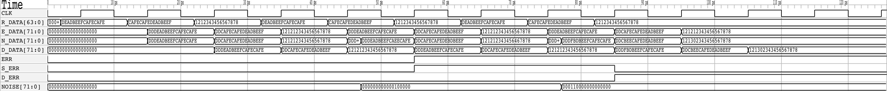
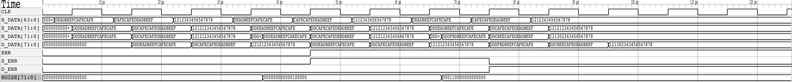

# SECDED RTL Code

SECDED implementation based on Hsiao's paper (https://people.eecs.berkeley.edu/%7Eculler/cs252-s02/papers/hsiao70.pdf). 

Parity check matrix of the (72,64) SECDED code, version 1 has been used.

## Project Structure
- `src`: folder containing source files
    - `1_cycle_part`: 1 cycle latency per block implementation (2 cycle latency in total)
    - `1_cycle_tot`: 1 cycle latency implementation
- `Makefile`: Makefile to automate the execution

## Signals explaination
- R_DATA: raw data
- E_DATA: encoded_data
- D_DATA: decoded_data
- N_DATA: noise_data, to simulate the noise, a xor with a mask which changes during the simulation has been used
- NOISE: noise mask
- ERR: error detected flag
- S_ERR: single error flag
- D_ERR: double error flag

## 1 cycle part
In this implementation, both the encoder and the decoder need 1 clock cycle to process the data. 2 clock cycles are needed to encode and decode the data. It can be used if encoding and decoding happen in different clock cycles.

## 1 cycle tot
In this implementation, the encoding and decoding operations are made in the same clock cycle.

## How to run
Before simulate, the following dependencies need to be installed:
- verilator
- gtkwave
- make

Since a Makefile is available, all the operations are listed here:
- `make build`: creates all the build folders needed
- `make partial`: calls verilator to translate the 1\_cycle\_part verilog files in C++ files and launches the simulation
- `make total`: calls verilator to translate the 1\_cycle\_tot verilog files in C++ files and launches the simulation
- `make partial_wave`: calls make build, make partial, and open the 1\_cycle\_part waveform via gtkwave
- `make total_wave`: calls make build, make partial, and open the 1\_cycle\_tot waveform via gtkwave
- `make clean`: removes the build directory and subdirectories
